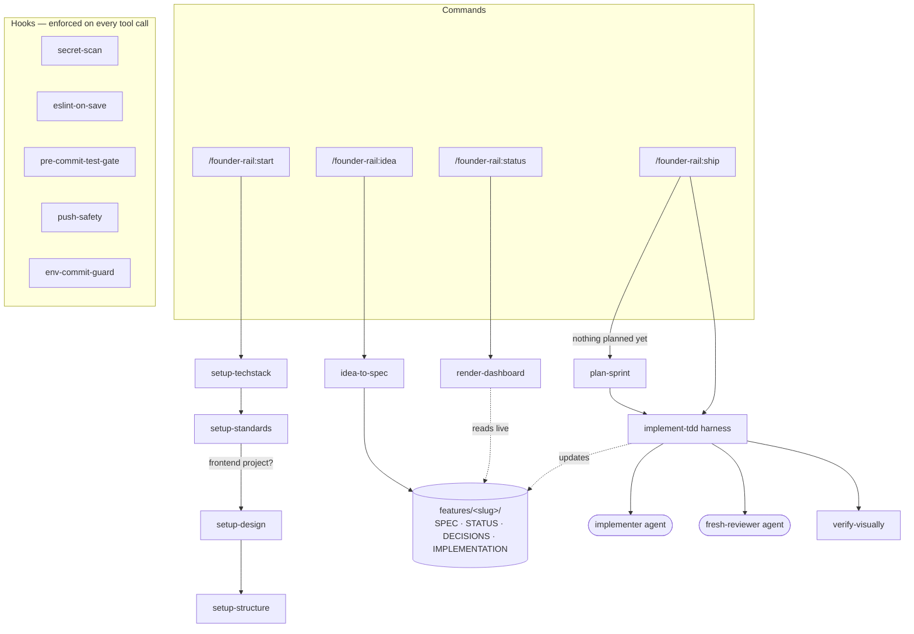
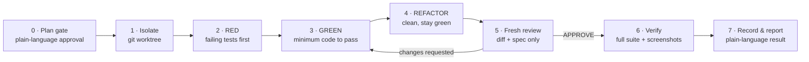

# founder-rail

Quality-gated, spec-driven development for people who can't code — or can, but don't want to make architecture decisions.

founder-rail is a Claude Code plugin that puts guard rails around AI-driven development from day one of a project:

1. **Tech stack, decided once** — Next.js fullstack by default, a separate NestJS backend only when the user's answers signal a real need for one — picked from outcome questions, never technical ones.
2. **Real code standards** — picked from public style guides (Airbnb-style, Standard-style, or TypeScript-strict) based on 2 *business* questions, never technical ones. Generates working ESLint/Prettier config, plus an always-on security baseline (no `eval`/raw-HTML injection, no `.env` in commits, dependency audit) built from near-zero-false-positive rules only.
3. **Design direction** — for frontend projects: choose a feeling (minimal / bold / playful), get real design tokens.
4. **Folder/component structure** — flat, feature-based, or atomic-design, picked from one outcome question, enforced with import-boundary lint rules riding the same save hook.
5. **Spec-driven harness** — no code before an approved plan, strict RED→GREEN→REFACTOR TDD, fresh-context reviewer that never saw the implementation history, screenshot round-trip verification for UI.
6. **Permanent product knowledge** — every feature lives in `features/<slug>/` as plain markdown: `SPEC.md`, `DECISIONS.md`, `STATUS.md`, `IMPLEMENTATION.md`.
7. **Zero-database kanban** — project status derived at read time from `STATUS.md` frontmatter. No server, no DB.

## Non-negotiable principles

| # | Principle |
|---|-----------|
| 1 | The user never makes a technical decision — all questions are outcome/business questions |
| 2 | Critical rules are enforced by **shell hooks**, not prompts (lint on save, tests before commit, secret scan, no force-push) |
| 3 | Markdown-only persistence — status is derived at read time, never cached |
| 4 | Verification never requires the user to read code — automated tests + screenshots are the proof |
| 5 | Every important output passes through a plain-language layer, with ⚠️ risk indicators for production/payment/data actions |
| 6 | Plan-then-approve gate before every implementation |

## Install

```
/plugin marketplace add <this-repo>
/plugin install founder-rail
```

## Quickstart

| Command | What it does |
|---------|--------------|
| `/founder-rail:start` | One-time setup: standards, design, project scaffolding |
| `/founder-rail:idea` | Turn a plain-language idea into a tracked feature spec |
| `/founder-rail:status` | Kanban board derived from markdown — what's where |
| `/founder-rail:ship` | Build the next planned feature through the full quality harness |

## How the skills work

Commands are thin entry points; each one invokes a **skill** that holds the real logic. Skills create markdown under `features/<slug>/`, and the build harness delegates to **agents**. Shell **hooks** enforce the safety rules at tool-call time, underneath everything.



### The build harness (`implement-tdd`) in detail

`/founder-rail:ship` runs one feature through seven phases that cannot be skipped:



### What each skill does

- **`setup-techstack`** — one-time, runs first. Asks outcome questions (does another client need the same API, is there heavy background work) and derives the stack itself: `next-fullstack` (Next.js doing both frontend and backend) by default, `next-nest` (Next.js + a separate NestJS backend, pnpm monorepo) only when the answers signal a real need. Scaffolds it, verifies it builds and boots, and writes section 1 of `constitution.md`.
- **`setup-standards`** — one-time. Asks the user only *business* questions (how strict, who will maintain the code) and derives every technical choice itself. Copies the `airbnb-style` ESLint + Prettier preset into the project, installs dev dependencies, and verifies lint actually runs before declaring done. Writes section 2 of `constitution.md`.
- **`setup-design`** — one-time, frontend only. Turns a chosen *feeling* (minimal / bold / playful) into real design tokens, and records the rule that all UI code must use tokens (no hard-coded colors, sizes, radii).
- **`setup-structure`** — one-time, frontend only. Asks one outcome question (small/demo, growing into several features, or design-heavy UI) and picks `flat`, `feature-based`, or `atomic-design`. Wires import-boundary and naming-convention ESLint rules into the project's existing lint config — riding the `eslint-on-save` hook — and writes section 4 of `constitution.md`.
- **`idea-to-spec`** — turns a plain-language idea (or an `inbox/` file) into a tracked feature. Asks at most 3 outcome-level questions (never about databases, frameworks, or architecture) and scaffolds `features/<slug>/` with `SPEC.md`, `STATUS.md`, `DECISIONS.md`, and `IMPLEMENTATION.md`. The slug names the *outcome* (`email-signup`), not the tech.
- **`plan-sprint`** — groups `backlog` features into a simple sprint. Asks one outcome question about what matters most now, respects `blocked_by` order, caps a sprint at 5 items, and marks the chosen features `planned`. No story points or velocity.
- **`implement-tdd`** — the build harness (diagram above). The only place implementation code is ever written: plan-approval gate → strict RED→GREEN→REFACTOR TDD → fresh-context review → verification → documentation update. Delegates larger builds to the `implementer` agent.
- **`verify-visually`** — for features with a visible UI. Drives the app and captures screenshots via Playwright, checking them against the acceptance criteria and design tokens — proof the user can see without reading code. Part of the harness, not optional.
- **`render-dashboard`** — the zero-database kanban. Re-reads `features/*/STATUS.md` frontmatter every time (never cached) and renders a text board — Backlog · Planned · In progress · In review · Done — plus one suggested next action.

## Repo structure

```
founder-rail/
├── .claude-plugin/{plugin.json, marketplace.json}
├── skills/{setup-techstack, setup-standards, setup-design, setup-structure,
│            idea-to-spec, plan-sprint, implement-tdd, verify-visually,
│            render-dashboard}/SKILL.md
├── agents/{implementer.md, fresh-reviewer.md}
├── stacks/{next-fullstack, next-nest}/
├── standards/{airbnb-style, standard-style, typescript-strict}/
├── structure/{flat, feature-based, atomic-design}/
├── security/baseline/       ← always-on, merged by setup-standards
├── hooks/{hooks.json, eslint-on-save.sh, pre-commit-test-gate.sh,
│           secret-scan.sh, push-safety.sh, env-commit-guard.sh}
├── commands/{start.md, idea.md, status.md, ship.md}
├── constitution.md          ← template, copied into the user's project
├── inbox/                   ← raw untriaged ideas (in the user's project)
└── features/<slug>/         ← per-feature knowledge (in the user's project)
```

## v1 scope

- Two tech-stack presets: `next-fullstack` (default) and `next-nest`, both TypeScript
- Three standards presets: Airbnb-style, Standard-style (StandardJS via neostandard), TypeScript-strict
- Three structure presets: `flat`, `feature-based` (default), `atomic-design`
- Dashboard is a text board in chat (HTML dashboard later)
- Single user (no team/role modes)

Out of scope for v1: multi-editor support, real-time server dashboards, compliance presets (GDPR/HIPAA), team permissions, mobile stacks.

## License

MIT. Contributions accepted under DCO (see CONTRIBUTING.md).
